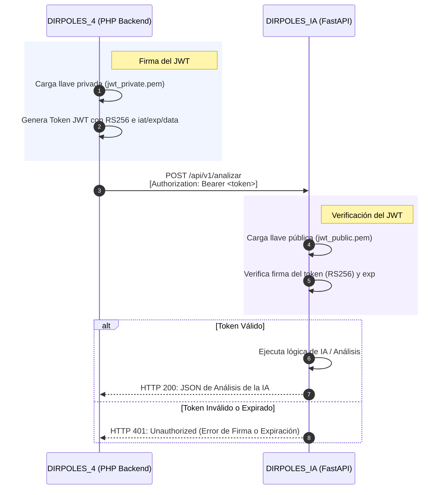

# 📋 Tareas Pendientes para el Microservicio DIRPOLES_IA

Este documento detalla de manera exhaustiva el estado actual del microservicio y enumera las tareas pendientes organizadas en módulos lógicos. Está diseñado para que puedas convertirlas directamente en tarjetas de tu tablero de **Trello**, manteniendo un control total sobre el avance del proyecto.

---

## 🗺️ Arquitectura de Seguridad Actual (RSA / RS256)

El microservicio ha sido actualizado con un esquema de seguridad asimétrica premium. A continuación se muestra cómo se realiza la comunicación segura entre el monolito en PHP y el microservicio en FastAPI:

---

## 🎯 Estado General del Proyecto

*   **Entorno Virtual y Python**: 🟢 Configurado e instalado con éxito.
*   **Dependencias de Librerías**: 🟢 Instaladas y actualizadas en `requirements.txt` (incluye `FastAPI`, `uvicorn`, `PyJWT` y `cryptography`).
*   **Seguridad RSA**: 🟢 Implementada, con soporte para caché en memoria de llave pública y fallback híbrido de `X-API-Key`.
*   **Prueba de Integración RSA**: 🟢 Validada con éxito (`test_rsa_validation.py` simuló la firma de PHP y la verificación de Python satisfactoriamente).

---

## 🗂️ Lista de Tarjetas y Checklist para Trello

### 📁 MÓDULO 1: Configuración en Producción y Llaves (Backlog ➔ Done 🟢)

> [!NOTE]
> Este módulo está prácticamente **Completado**. Solo requiere configuración de variables específicas al desplegar en servidores reales de producción.

- [x] **Instalar dependencias de cifrado asimétrico**
  - Instalar `pyjwt` y `cryptography` en el entorno virtual (`venv`).
  - Congelar dependencias actualizadas en `requirements.txt`.
- [x] **Configurar la Llave Pública en el Microservicio**
  - Copiar la llave pública `jwt_public.pem` del backend PHP al directorio `certs/` del microservicio.
  - Actualizar el archivo `.env` del microservicio con las rutas correctas (`certs/jwt_public.pem`) y algoritmo (`RS256`).
- [x] **Implementar la lógica de validación RSA**
  - Crear en `app/security.py` la carga cacheada de la llave pública.
  - Implementar dependencia de FastAPI `verificar_jwt` para extraer y validar el token.
  - Implementar dependencia híbrida `autenticar_peticion` para soportar JWT y `X-API-Key` (desarrollo).
- [ ] **Despliegue de Llaves en Producción**
  - Asegurar que la carpeta `certs/` esté incluida en el despliegue del microservicio en producción o inyectar la clave directamente usando la variable de entorno `JWT_PUBLIC_KEY_PEM` en el archivo `.env`.

---

### 📁 MÓDULO 2: Definición de Estrategia de Transporte de Datos (Por Hacer 🟡)

> [!IMPORTANT]
> **Decisión de Arquitectura Crítica:** Debes decidir cómo transferir los datos del reporte desde el backend al microservicio.

- [ ] **Analizar y Seleccionar la Estrategia de Datos**
  - *Opción A (Push - Actual):* El PHP consulta los datos de la base de datos, los serializa a un gran JSON y los envía en el cuerpo de la petición HTTP. (Ideal para reportes pequeños de < 1,000 registros).
  - *Opción B (Pull - Recomendada para Escalabilidad):* El PHP envía solo un token JWT que contiene los filtros de consulta (por ejemplo: `id_reporte`, `fecha_inicio`, `fecha_fin`). El microservicio en Python usa su propia conexión SQLAlchemy (`app/database.py`) para consultar la base de datos compartida y extraer los datos directamente de forma ultra veloz.
- [ ] **Implementar Modelos de SQLAlchemy (Si se elige Opción B - Pull)**
  - Crear esquemas ORM en `app/database.py` o consultas SQL puras con `ejecutar_consulta` para extraer datos directamente desde las tablas `atenciones`, `beneficiario`, `pnf`, etc., reduciendo drásticamente la latencia de red.

---

### 📁 MÓDULO 3: Integración de Inteligencia Artificial (LLM / RAG) (En Progreso 🔵)

> [!TIP]
> Actualmente el microservicio devuelve heurísticas estadísticas básicas en `app/services/analisis.py` con Python puro. Debemos implementar las consultas reales a un motor de Inteligencia Artificial.

- [ ] **Seleccionar el Proveedor de IA**
  - Elegir entre una API externa (por ejemplo: **OpenAI GPT-4o**, **Google Gemini Pro** o **DeepSeek API**) o un modelo de lenguaje de código abierto alojado localmente en tu propio servidor (utilizando **Ollama** con `Llama-3` o `DeepSeek-R1` de manera 100% gratuita y sin necesidad de internet).
- [ ] **Configurar Credenciales en `.env`**
  - Añadir la variable correspondiente (`OPENAI_API_KEY`, `GEMINI_API_KEY` o `OLLAMA_HOST`) en el archivo `.env`.
  - Cargar las variables en `app/config.py`.
- [ ] **Implementar Conector del Cliente LLM**
  - Crear un servicio en `app/services/llm.py` que se encargue de estructurar las llamadas a la API de la IA seleccionada de forma asíncrona.
- [ ] **Diseñar System Prompts Especializados para Reportes**
  - Crear Prompts del Sistema que guíen a la IA a analizar adecuadamente los datos de acuerdo con el tipo de reporte (`general`, `psicologia`, `medicina`, `orientacion`, `becas`, `discapacidad`, `transporte`, `mobiliario`, `jornadas`, `referencias`).
  - La IA debe devolver un análisis estructurado que encaje perfectamente en el esquema `AnalisisOutput` (Resumen, Hallazgos Clínicos/Estadísticos, Recomendaciones).
- [ ] **Implementar Flujo Conversacional / Preguntas (RAG)**
  - Mejorar el endpoint `/api/v1/preguntar` en `app/services/analisis.py` para que concatene la pregunta del usuario con los datos estadísticos formateados como contexto y envíe todo al LLM para obtener una respuesta conversacional ultra precisa.

---

### 📁 MÓDULO 4: Implementación del Cliente en DIRPOLES_4 (PHP) (Por Hacer 🟡)

> [!IMPORTANT]
> El backend de PHP necesita poder generar los tokens y realizar las solicitudes REST al microservicio FastAPI.

- [ ] **Crear Servicio Cliente HTTP en PHP**
  - Desarrollar una clase de utilidad HTTP (ej. `app/Core/MicroserviceClient.php` o similar) en el backend PHP de DIRPOLES_4.
  - Implementar el envío de peticiones mediante `cURL` o `Guzzle` hacia el microservicio (`http://localhost:8000/api/v1/analizar` y `/preguntar`).
- [ ] **Integrar Firma Asimétrica en PHP**
  - Usar la clase `JwtHandler.php` ya existente en DIRPOLES_4 para generar el token JWT firmado con la llave privada `jwt_private.pem`.
  - Adjuntar este token como header `Authorization: Bearer <token>` en la petición HTTP al microservicio.
- [ ] **Diseñar Vistas de Reportes con Análisis de IA en el Frontend PHP**
  - Modificar las interfaces de los reportes en DIRPOLES_4 para añadir un botón interactivo premium: **"Generar Análisis con IA"**.
  - Al pulsar el botón, mostrar una animación de carga (*spinner*) moderna, realizar la llamada Ajax al backend de PHP (que a su vez consulta al microservicio), y pintar el resultado de forma interactiva (usando cajas de texto formateadas en Markdown, gráficos dinámicos o listas colapsables).
- [ ] **Añadir Chatbot de Reporte en el Frontend PHP**
  - Crear una interfaz de chat interactiva al pie del reporte donde el usuario pueda escribir una pregunta (ej: *"¿Cuál fue el PNF con más incidencias de salud mental en enero?"*) y el backend de PHP le pase esta pregunta al endpoint `/preguntar` del microservicio para pintar la respuesta de la IA en tiempo real.

---

### 📁 MÓDULO 5: Despliegue, CORS y Monitoreo (Por Hacer 🟡)

> [!WARNING]
> Para que el microservicio pueda funcionar correctamente en un entorno real con usuarios concurrentes, debemos configurarlo como un servicio de fondo en el servidor.

- [ ] **Configurar CORS de Forma Estricta**
  - Configurar `ALLOWED_ORIGINS` en el archivo `.env` del microservicio para permitir únicamente peticiones provenientes del dominio/IP exacto de DIRPOLES_4, bloqueando cualquier otra petición del exterior.
- [ ] **Configurar Demonio del Microservicio en Windows (XAMPP Server)**
  - Instalar y configurar **NSSM (Non-Sucking Service Manager)** o usar **PM2** para registrar el comando `uvicorn app.main:app --host 0.0.0.0 --port 8000` como un servicio del sistema Windows.
  - Esto garantizará que el microservicio se inicie automáticamente cuando se encienda la laptop/servidor y se reinicie de inmediato si hay algún fallo del sistema.
- [ ] **Pruebas de Carga y Expiración del JWT**
  - Validar que si el JWT expira, FastAPI devuelve correctamente un error HTTP 401 y el PHP maneja el error solicitando un nuevo token automáticamente sin que el usuario final note la interrupción.
  - Medir la velocidad de respuesta con diferentes volúmenes de datos clínicos para evitar bloqueos del hilo de ejecución.

---

## 🛠️ Tabla de Resumen para Trello

Si deseas copiar y pegar el flujo rápido en tu Trello, esta es la jerarquía sugerida de tus tarjetas en la lista **"Por Hacer / Backlog"**:

| ID Tarjeta | Título de la Tarjeta | Dificultad | Sprint Estimado | Prioridad |
|---|---|:---:|:---:|:---:|
| **IA-01** | Configurar y unificar llaves asimétricas RSA en Producción | Baja | Sprint 1 | Alta |
| **IA-02** | Definir Estrategia de Datos para Reportes Grandes (Push vs Pull) | Media | Sprint 2 | Alta |
| **IA-03** | Conectar FastAPI con Proveedor de Inteligencia Artificial (LLM) | Alta | Sprint 3 | Alta |
| **IA-04** | Diseñar Prompts de Análisis Clínico/Estadístico por tipo de reporte | Media | Sprint 3 | Media |
| **IA-05** | Implementar Cliente HTTP y Firma JWT en PHP (DIRPOLES_4) | Media | Sprint 4 | Alta |
| **IA-06** | Diseñar Panel de Visualización del Análisis de IA en la Web de PHP | Alta | Sprint 4 | Media |
| **IA-07** | Crear Interfaz de Chatbot / Consultas de Reportes en PHP | Alta | Sprint 4 | Baja |
| **IA-08** | Configurar PM2 / NSSM para ejecutar FastAPI como Servicio de Windows | Baja | Sprint 5 | Alta |

---

> [!TIP]
> **¡Recomendación Técnica!**
> Al iniciar el Sprint 3, te recomiendo encarecidamente utilizar **Ollama** si deseas ejecutar la IA de forma local y 100% gratuita. Modelos como `DeepSeek-R1 (8B)` o `Llama-3 (8B)` corren de forma excelente en laptops modernas y proveen análisis clínicos y organizacionales con una calidad asombrosa, manteniendo todos los datos de salud institucional totalmente confidenciales y seguros dentro de tu propia infraestructura.
